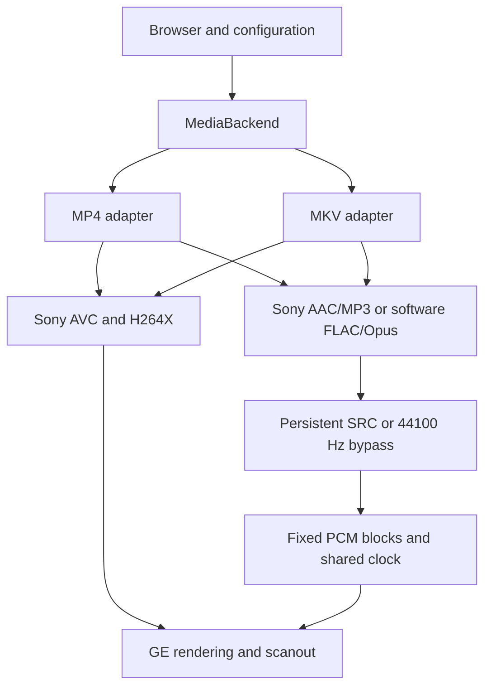

# PMPlayer Ultraviolet playback architecture

## Flow and owners

`main.cpp` initializes memory, hardware policy and the browser. `player.cpp`
owns browser input and the existing directory/selected-metadata workers.
`media/MediaBackend.cpp` performs metadata-only probing and synchronous dispatch.
`common/ppa_playback_session.c` owns the session, power policy, audio timeline
and shared audio-only producer. `mod/mp4_play.c` and `mkv_play.c` retain their
container-specific decode, seek and output loops. Only one movie is active.

The selected Boost headers stay on C++ application
boundaries. UI resource owners reject copying; modal scoped pointers preserve
normal cleanup timing and release the Quit dialog on early loop exit. The
configuration pointer table is inline in its existing heap-owned dialog.
Compile-time checks guard platform widths, scratchpad boundaries, VFPU layout,
the UI cache record, PCM block requirements and the plain-value audio format.
Boost does not replace C queues, allocator pairs or firmware lifetime control.
Audio packet/metadata structures were extended and require all local consumers
to be rebuilt together.

The decode producer owns demux, Sony/software decode, SRC state and normal GE rendering. The show
worker paces completed frames and retains scanout leases until a new VBlank
swap completes. The audio worker blocks on PCM output. Priority numbers follow
PSP policy: audio 0x18, show 0x20, decode 0x28 and storage 0x32; browser workers are
below playback. `ppa_thread_policy` gates VFPU context ownership where needed.

The frame sink queues NEXTFRAME, then waits for VBlank before releasing the old
surface. Audio timestamps are published after firmware accepts PCM, with
unplayed-sample accounting and a second epoch check. Video deadlines follow
valid audio; a wall anchor is only the no-audio fallback. Optional Health
sampling polls the timeline semaphore and may retain the last sample.

## Storage and parser boundaries

| Layer | Relevant paths |
| --- | --- |
| Local filesystem dispatch | `common/directory.c`, `ppa_vfs.c` |
| FAT / partition / NTFS | `common/fat.c`, `ppa_ms_partition.c`, `ppa_ntfs.c` |
| Browser name cache | `common/ppa_browser_fs_cache.c` |
| Metadata-only readers | `libbufferedio.psp`, `libmp4info.psp`, `libmkvinfo.psp` |
| Playback admission / indexes | `mod/mp4_file.c`, `mkv_file.c` |
| Packet reads / lacing / seeks | `mod/mp4_read.c`, `mkv_read.c` |
| Buffered playback I/O | `common/buffered_reader.c`, `ppa_io_pump.c` |
| Bounded packet ownership | `common/ppa_packet_pool.c`, `ppa_media_packet.c`, `ppa_queue_watermark.c` |

Paths without a repository prefix in this document are under `ppu/`.
Native `ms0:/` and `ef0:/` plus read-only `ms1:/` are the storage contract.
MP4 atom/sample/seek and MKV metadata/cue offsets are 64-bit. Existing caps include
8 MiB cumulative MP4 metadata and 12 MiB combined sample/seek indexes. Wider
addresses do not remove file-system, heap, chunk or driver limits.

The browser displays cached names immediately. Every directory scan, including
the first uncached listing, and selected-media probes wait for two seconds
without input. The sampler publishes an atomic kernel-clock activity timestamp
for presses, holds and releases, independently of UI dispatch. Directory scans
park at read/entry boundaries until the quiet period returns, retaining their
cursor. Metadata probes cancel on renewed activity. Generation changes cancel
either task on navigation or teardown. The UI transfers its latest directory
request through a polled mailbox; it never waits for the worker's bookkeeping
semaphore during navigation.

All directory results wait for quiet publication. A refresh preserves the current
exact leaf name and viewport, and discards an unchanged listing without resetting metadata.
Navigation copies request paths/names before a cache hit frees the previous list.
UI bookkeeping uses nonblocking polls. A separate ten-second idle cutoff parks
background card work. Parser cancellation is cooperative at I/O boundaries;
no UI thread forcibly closes a worker-owned descriptor. FAT lookup/enumeration
opens its parallel firmware-name walk only on the older firmware that uses it.

`browser_text_cache.cpp` retains at most 512 KiB of CPU raster pixels in 64
bounded records (about 35 KiB of bookkeeping). Filename rows normally prime both
cursor styles, so selection moves reuse exact FreeType output. Large viewports
use demand caching to avoid evicting their own primed rows. Cache pixels are
released before playback, font reload and resume; allocation failure uses the
original renderer. Only the existing UI owner draws or submits GE work. Idle
repaints and metadata values wait for input idle. Cold text rendering and
in-flight storage syscalls remain latency limits.

## Decode, rendering and H264X

Both containers use `mod/mp4avcdecoder.c`. Sony firmware still performs AVC
reconstruction; H264X parses/rewrites compressed headers and tracks/restores
presentation. It is not a general software AVC decoder or arbitrary motion
compensation implementation. SPS/PPS and source data remain immutable across
compatibility retries. A successful open is not evidence of decoder fidelity.

Admitted video remains progressive 8-bit 4:2:0 with coded size at most 720x480.
MP4 admits its existing Baseline 720x480 path; MKV Baseline retains its 480x272
limit. Audio admission is described below.
CABAC, weights, multi-B and strict-pyramid combinations require encode-specific
observation. No new deep DPB, 8x8 transform conversion or custom ME work was added.

`mod/gu_draw.c` scales decoded RGB, applies brightness and composites subtitles,
interface textures and Health. `media/VideoPipeline` now retains only optional
Fit PSP Screen color/range compensation. Its scalar/VFPU arithmetic and shared
accelerator/cache infrastructure remain; it is LCD-only and saver bypasses it.

LCD direct scanout uses three 512x272x4 eDRAM surfaces when topology allows.
Otherwise GE copies to the container's owned output ring. TV restores its
720x480 GE canvas with 768 pitch every submission; interlace converts that canvas
into two fields within 512 storage rows. Retained MKV presentation surfaces use
output canvas/storage dimensions, never coded-image height. Allocation failures
retain existing bounded fallback behavior.

No CPU may mutate a device-read surface without the corresponding publication
and completion boundary. GE list ownership spans start through finish/sync.
Workers must be joined before decoder buffers, fallback fonts or code are freed.

## Audio stream

`mod/audio_format.c` shares bounded codec admission between browser metadata
and playback. Selected configurations are copied before MP4 metadata is freed.
`mod/audio_software.c` adapts dr_flac and the PSPDEV-target libopus packet API;
`mod/audio_stream.c` owns source trimming, PCM staging, SRC history and a 64-bit
output sample counter. The existing Sony AAC/MP3 interface remains the native
decoder. New codec support is mono/stereo only.
The package binding is recorded as follows: headers and the
static archive come from one target prefix, with compile-time PCM ABI checks.
Opusfile is an Ogg stream layer and is not inserted between PPU's demuxers and
the packet decoder. The retrieved package recipe does not explicitly enable
fixed-point DSP; it also permits external build options. The installed library's
arithmetic configuration needs its corresponding build record.

The output contract is always 44100 Hz, signed 16-bit stereo, 1024 frames per
block. Matching-rate input bypasses SRC. Other admitted input uses libsamplerate
with state retained across packets and backpressure. No recurring general heap
allocation, new audio worker or additional governor is introduced by the adapters.
The old endpoint/VFPU resampling worker is not activated for this path.

`mod/audio_pcm_vfpu.c` now batches eight samples for the s16/float conversions
around SRC on that same producer. Stream arrays are explicitly aligned, with
scalar head/tail/alignment fallback and a scalar output fallback for CP1
rounding modes other than nearest. `ppu_audio_stream_thread_attributes` adds
VFPU context to the MP4/MKV producer only when SRC exists and the build gates
permit it, including Audio Only Mode. Track admission preserves decoded rate.
The output/display workers gain no audio VFPU work. `PPU_AUDIO_VFPU_PCM=0`
retains scalar conversion and the original producer attributes. No new worker,
scratchpad partition, sample buffer, runtime probe or clock policy is added.
See the VFPU review for rounding,
register/prefix ownership, PSP-1000 alignment and unmeasured performance limits.

Default quality is linear; fastest sinc is an explicit build-time opt-in and
Battery Saver always selects linear at stream open. This is a conservative
cost policy, not a measured quality/performance optimum. Upstream sinc double
arithmetic remains unchanged. Normal A/V reports decode/SRC CPU service through
the existing resampling-cost hook; audio-only retains paired service/codec
observations. The governor remains the sole clock owner.

The pinned libsamplerate wrappers now specialize constant stereo linear SRC
for integer 8000–48000 Hz input and 44100 Hz output. Phase uses integer ticks;
sample interpolation uses scalar binary32. Upstream state/reset/clone/free and
the variable-rate fallback remain in use, with no new per-packet allocation.
The wrapper also converts s16 input to float without an intermediate double;
SRC ratio is computed once per stream. `PPU_AUDIO_FAST_LINEAR=0` restores the
upstream linear kernel. Vendored source bytes stay unchanged; this adapter must
be reviewed when updating the pinned library.

FLAC above 16 bits uses the public s32 read API in 512-frame tiles and rounded,
saturated integer conversion into s16 staging. A disjoint 4 KiB tile comes from
the existing 128 KiB arena; the general allocator is never used per packet.
True 32-bit FLAC is still outside admission. Opus uses its validated packet
duration as the output capacity and retains the integer PCM API. MP3 validates
duration before the firmware call and copies only valid output; Sony's aligned
workspace and maximum decode request remain intact.

Gain/channel processing joins decode/SRC cost reports. The audio-only producer
accumulates active service and codec work across partial-block retries, publishes
once when a block completes, and yields to the scheduler on retry. Semaphore,
pause and explicit retry-yield waits are excluded from the active measurements.

MP4 dOps/dfLa and bounded single-entry audio edits retain source sample positions
and durations. Opus MP4 priming follows elst rather than blindly applying dOps
PreSkip. MKV carries CodecDelay, SeekPreRoll and per-lace DiscardPadding.
Seeks reset histories under producer ownership; Opus demux begins early enough
for recovery while output keeps the original target/epoch gate. Track changes
reopen the selected configuration before decoding its packets.

Natural EOF drains converter history, one padded hardware block if necessary,
the output queue and the hardware channel. Queue publication counts precede
semaphore signals; both accepted and stale-epoch blocks retire those counts.
Stop/pause remain cooperative. Decoder state is released after owner joins.
Audio timestamps derive from actual output samples, preserving fractional
conversion ratios instead of rounding each compressed packet's duration.

## Text and diagnostics

`ftfont.cpp` provides UI HarfBuzz/FriBidi shaping and bounded lazy fallback among
bundled faces. Filenames retain raw filesystem bytes for opening; display
coverage is independent of UI-language selection. Three streamed fallback faces
per font and bounded glyph caches limit memory. Browser fallback faces are
released before playback and after Health preparation.

`mod/gu_font.c` owns independent subtitle raster/atlas behavior. Saver replaces
outline stroking with a fill-glyph shadow while preserving shaping and layout.
Subtitle loaders validate text lengths/timestamps and use the common sorted
cue list. Unsupported rich ASS behavior remains unsupported.

`media/PlaybackUi.cpp` bakes translated text before workers start, then composes
Health digits/status at most once per second without font I/O. Once enabled,
the cached Health texture remains visible across optional-work backoff. TV
coordinates use the active output rectangle. Audio-only updates a static
surface, avoiding AVC and per-frame GE rendering.

## Power, controls and lifecycle

`mod/cpu_clock.c` remains the sole CPU/bus governor. Producer costs are published
into bounded observations; presentation consumes them. Saver alone adds a soft
pressure grace, shorter recovery holds and cheaper subtitles. Real repeated
drops/audio starvation still recover. Its strict native-video/CBR-like audio admission and
H264X bypass remain. No measured power savings are implied by source policy.

`common/ctrl.c` emits immediate 4 Hz playback Left/Right and responsive repeating
browser Up/Down; other singles/chords retain their context-specific contract.
The locked latest-target mailbox coalesces work while a seek is in flight.
The producer owns decoder reset; the show worker owns its epoch timing/history
reset and validates the actual buffer epoch for arrival.

Sleep is per-movie wall time including pause. Pause/stop/suspend use worker-safe
points outside hardware calls. Audio-only suppresses video/subtitles and uses
auto display-off after 30 seconds; wake input is consumed. Session close restores
borrowed display/power ownership before releasing buffers. TV error panels keep
DVE mode and use a full-sized reserved surface.

Firmware codec teardown is shared by both containers through
`media_codecs_close`. It runs after playback-owner joins and before channel
drain, resume-file writes or reader destruction. AVC reserves its 32 KiB close
worker before initialization, records a single firmware owner and frees buffers
only after Delete/Finish return. Full codec close invalidates the boot-mode
cache; AVC-only seeks preserve it while audio remains initialized. A boot-mode
change is rejected while either codec is live.

Timeouts retain owners/resources and continue joining in one-second slices;
late completion resumes ordinary cleanup. Killed/invalid owners still
quarantine. Application exit releases the idle AVC arena and stops/unloads
only owned MPEG-VSH/AVCODEC modules, in dependency order. See
the media lifecycle for error cases and hard-crash limits.
